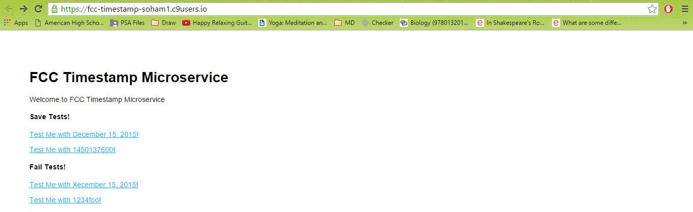
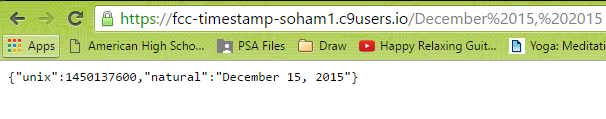
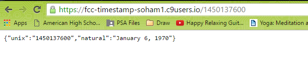
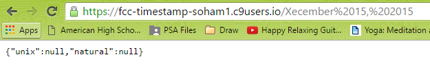
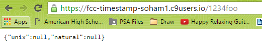
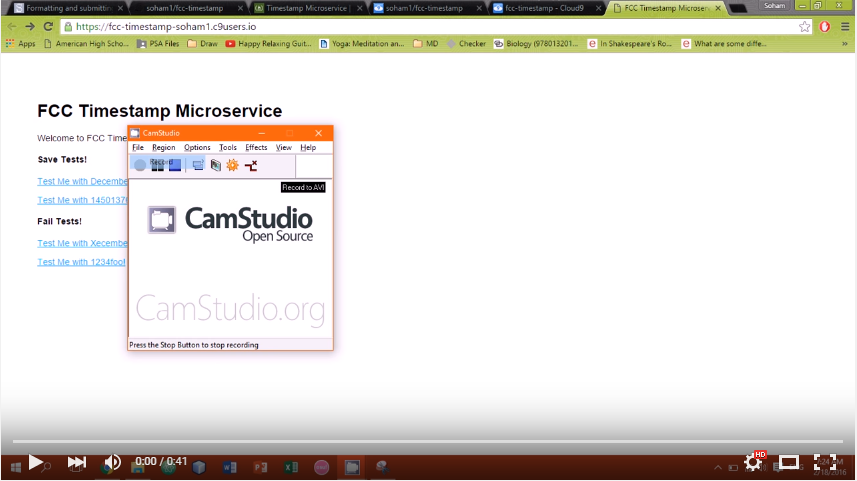

# Timestamp Microservice

This is a solution for http://www.freecodecamp.com/challenges/basejump-timestamp-microservice.

User Story: I can pass a string as a parameter, and it will check to see whether that string contains either a unix timestamp or a natural language date (example: January 1, 2016).

User Story: If it does, it returns both the Unix timestamp and the natural language form of that date.

User Story: If it does not contain a date or Unix timestamp, it returns null for those properties.

## Screenshots:

### Homepage

### Passed a normal date in the url.

### Passed a unix date in the url.

### Invalid dates do not work.

### Invalid unix dates do not work.

## Demo:

## Technologies Used:
- Node.js
- Express
